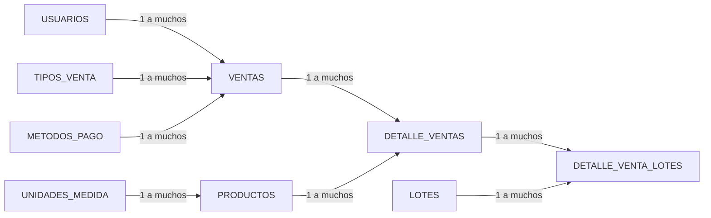
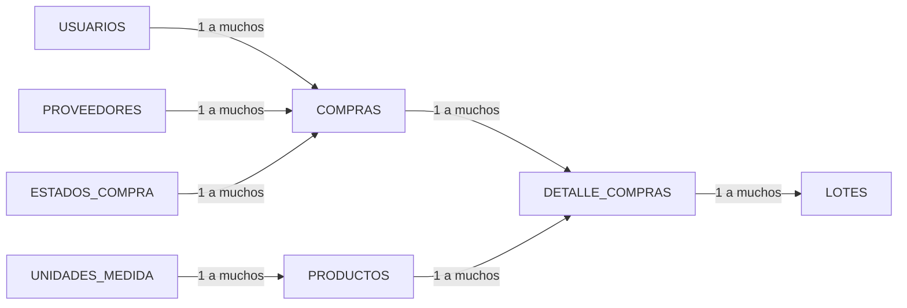
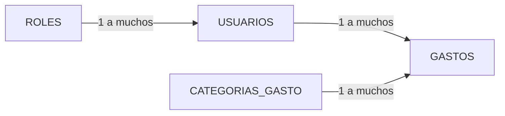

# DER resumido de Rapid Market

Esta versión separa el DER en tres vistas para que las tablas y las relaciones se vean grandes al abrir la vista previa de Markdown. Las cajas que aparecen en más de una vista representan la misma tabla real; se repiten solo para que el dibujo sea más fácil de leer.

## 1. Ventas e inventario

## 2. Compras e ingreso al inventario

## 3. Usuarios y gastos

### Cómo abrirlo grande en VS Code

1. Abre este archivo y pulsa `Ctrl + Shift + V` para mostrar la vista previa.
2. Usa el panel de vista previa para cada diagrama; cada uno ocupa menos espacio que el DER completo.
3. Si tu VS Code permite zoom de Mermaid, puedes hacer clic en un diagrama y acercarlo. También puedes abrir la vista previa al costado con `Ctrl + K`, soltar esas teclas y luego pulsar `V`.

Las relaciones muestran cardinalidad simplificada: `1 a muchos` significa que una fila de la primera tabla puede relacionarse con varias filas de la segunda. El diagrama detallado, con columnas y claves, está en `DER_Y_MODELO_ESTRELLA.md`.
