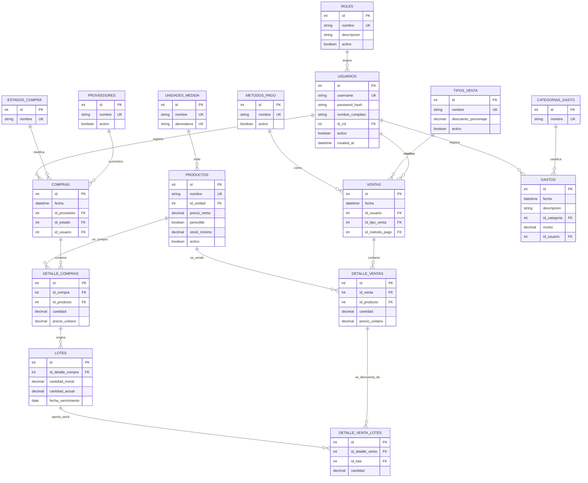
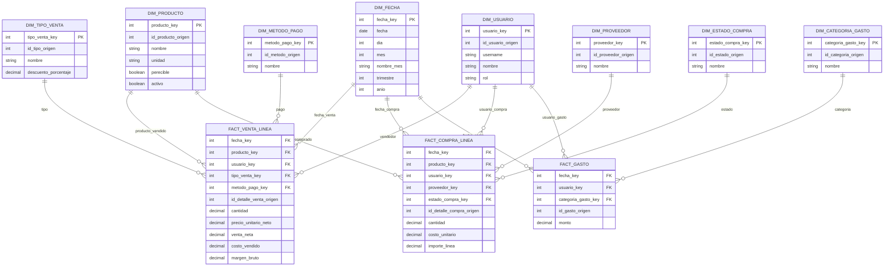

# DER y modelo estrella de Rapid Market

Este documento describe dos perspectivas distintas de la base de datos:

- **DER operativo:** representa las tablas relacionales que usa actualmente la aplicación para registrar compras, inventario, ventas y gastos.
- **Modelo estrella propuesto:** organiza esos datos para consultas y reportes analíticos. Es una propuesta de almacén de datos; sus tablas no existen todavía en PostgreSQL.

El DER se preparó a partir de `backend-martin/database_schema_pg16.sql`, que el README indica para PostgreSQL 16. Se incluyen las 16 tablas del negocio. Las tablas internas de Django (sesiones, migraciones y permisos) se omiten porque no representan operaciones de Rapid Market.

## 1. DER actual de la aplicación

### Cómo leer el DER

- `PK` identifica la clave primaria de una tabla; `FK` identifica una referencia a otra tabla; `UK` indica un valor único.
- Por ejemplo, una compra tiene proveedor, estado y usuario; además, puede tener varios renglones en `detalle_compras`.
- Una línea de venta puede consumir stock de uno o varios lotes. `detalle_venta_lotes` registra esa distribución y permite calcular el costo de lo vendido a partir del costo de compra de cada lote.
- La base no guarda un total separado en la cabecera de compra o venta: se obtiene sumando cantidad por precio unitario en sus detalles.
- En `detalle_ventas`, `precio_unitario` guarda el precio aplicado al vender (el backend lo calcula con el descuento del tipo de venta). El porcentaje elegido está en `tipos_venta`.
- La relación de un detalle de compra con los lotes permite varios lotes en el esquema, aunque el flujo actual normalmente crea uno por detalle.

## 2. Modelo estrella propuesto para reportes

Para analizar ventas, compras y gastos se propone un **esquema de constelación**: son tres estrellas que comparten dimensiones, cada una con el nivel de detalle apropiado para su operación. Esto evita mezclar en una sola tabla hechos que tienen significados y granularidades distintas.

### Granularidad y medidas

| Tabla de hechos | Una fila representa | Medidas principales | Origen en la base actual |
|---|---|---|---|
| `FACT_VENTA_LINEA` | Un producto dentro de una venta (`detalle_ventas`) | Cantidad, venta neta, costo vendido y margen bruto | `ventas`, `detalle_ventas` y el costo asignado mediante `detalle_venta_lotes` → `lotes` → `detalle_compras` |
| `FACT_COMPRA_LINEA` | Un producto dentro de una compra (`detalle_compras`) | Cantidad, costo unitario e importe de línea | `compras` y `detalle_compras` |
| `FACT_GASTO` | Un gasto registrado (`gastos`) | Monto | `gastos` |

Fórmulas sugeridas:

- **Venta neta** = `detalle_ventas.cantidad × detalle_ventas.precio_unitario`.
- **Costo vendido** = suma de `detalle_venta_lotes.cantidad × detalle_compras.precio_unitario` para los lotes asignados a esa línea.
- **Margen bruto** = venta neta − costo vendido. Los gastos se analizan aparte; para estimar el resultado después de gastos se restan de la suma del margen bruto en el período.
- **Importe de compra** = `detalle_compras.cantidad × detalle_compras.precio_unitario`.

### Dimensiones compartidas

- `DIM_FECHA` permite agrupar y filtrar por día, mes, trimestre o año. Se relaciona con cada hecho usando la fecha propia de esa operación.
- `DIM_PRODUCTO` permite comparar ventas y compras por artículo y unidad de medida.
- `DIM_USUARIO` permite analizar quién registró ventas, compras o gastos. El rol se conserva como atributo para segmentar los resultados.
- Proveedor y estado aplican a compras; tipo de venta y método de pago, a ventas; categoría, a gastos.

## 3. Consideraciones antes de implementarlo

1. Este modelo estrella es una **propuesta analítica**, no una modificación de las tablas que usa el sistema. Puede implementarse después en tablas de reporte o en una base de datos separada.
2. Para que el costo y el margen de cada venta sean confiables, todas las cantidades vendidas deben estar asignadas a lotes. Si falta una asignación, se debe marcar el costo como incompleto y no presentar el margen como definitivo.
3. La venta neta sí queda almacenada por línea. Para conservar también el porcentaje y monto exactos de descuento históricos si luego cambia la configuración del tipo de venta, conviene guardar esos valores aplicados en la venta o en su detalle.
4. La base actual mantiene la cantidad actual por lote, pero no guarda una fotografía diaria del inventario. Para analizar cómo variaba el stock en el pasado habría que empezar a registrar una tabla de hechos de inventario periódico (por ejemplo, una fila por producto y día).
